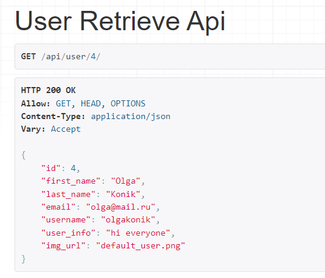
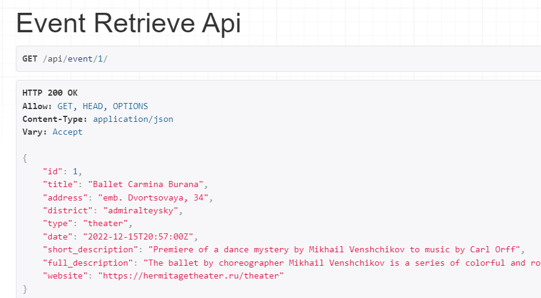
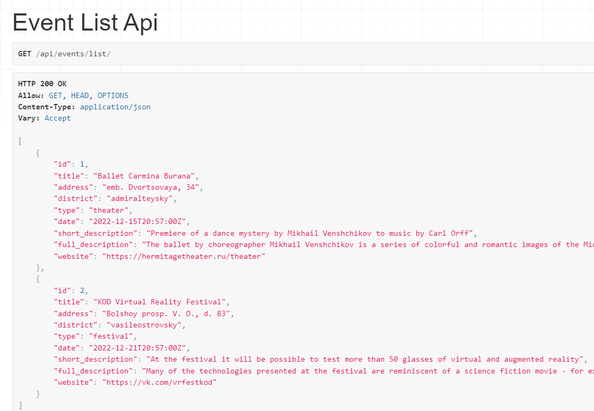

# Практическая работа №3

* `models.py`

```python
from django.db import models
from django.contrib.auth.models import AbstractUser


class Car(models.Model):
    car_id = models.IntegerField(primary_key=True)
    state_number = models.CharField(max_length=15, null=False)
    make_car = models.CharField(max_length=20, null=False)
    model_car = models.CharField(max_length=20, null=False)
    colour = models.CharField(max_length=30, null=True)


class CarOwner(AbstractUser):
    owner_id = models.IntegerField(primary_key=True)
    last_name = models.CharField(max_length=30, null=False)
    first_name = models.CharField(max_length=30, null=False)
    birthday = models.DateField(null=True)
    passport = models.CharField(max_length=12, null=True, blank=True)
    address = models.CharField(max_length=50, null=True, blank=True)
    nationality = models.CharField(max_length=30, null=True, blank=True)
    cars = models.ManyToManyField(Car, through='Ownership')

    def __str__(self):
        return self.owner_id.__str__()


class Ownership(models.Model):
    owner_car_id = models.IntegerField(primary_key=True)
    owner_id = models.ForeignKey(CarOwner, on_delete=models.CASCADE, related_name='owner')
    car_id = models.ForeignKey(Car, on_delete=models.CASCADE, related_name='car')
    start_date = models.DateField()
    expiration_date = models.DateField(null=True)

    def __str__(self):
        return "{}_{}".format(self.owner_id.__str__(), self.car_id.__str__())


class DriverLicense(models.Model):
    license_id = models.IntegerField(primary_key=True)
    owner_id = models.ForeignKey(CarOwner, on_delete=models.CASCADE, related_name='carOwner')
    license_number = models.CharField(max_length=10, null=False)
    type = models.CharField(max_length=10, null=False)
    date_of_license = models.DateField()
```

* `Database`

    * Cars

  
    * Owners

  
    * Licenses

  
    * Ownerships



## Задача 1. Создание объектов

Напишите запрос на создание 6-7 новых автовладельцев и 5-6 автомобилей, каждому автовладельцу назначьте удостоверение и от 1 до 3 автомобилей. Задание можете выполнить либо в интерактивном режиме интерпретатора, либо в отдельном python-файле. Результатом должны стать запросы и отображение созданных объектов.

Создание владельцев автомобилей:

```python
>>> from project_first_app.models import *

>>> owner1=CarOwner.objects.create(owner_id=1, last_name="Konik", first_name="Anastasia", birthday = "2002-11-24", passport = "6424474254", username = "AnastasiaKonik")
>>> owner2=CarOwner.objects.create(owner_id=2, last_name="Nazarov", first_name="Egor", birthday = "2001-07-09", passport = "6324432254", username = "EgorNazarov")
>>> owner3=CarOwner.objects.create(owner_id=3, last_name="Petrov", first_name="Alexander", birthday = "1994-08-19", passport = "6228974242", username = "AlexanderPetrov")
>>> owner4=CarOwner.objects.create(owner_id=4, last_name="Ivanov", first_name="Andrey", birthday = "1987-12-13", passport = "6228983241", username = "AndreyIvanov")
>>> owner5=CarOwner.objects.create(owner_id=5, last_name="Lopuhov", first_name="Fedor", birthday = "2000-02-20", passport = "6118985242", username = "FedorLopuhov")
>>> owner6=CarOwner.objects.create(owner_id=6, last_name="Korneev", first_name="Denis", birthday = "1996-08-09", passport = "6118124242", username = "DenisKorneev")
```

Создание автомобилей:

```python
>>> car1=Car.objects.create(car_id=1, state_number="T644AA", make_car="Toyota", model_car="Camry", colour="white")
>>> car2=Car.objects.create(car_id=2, state_number="H238KK", make_car="Hyundai", model_car="Solaris", colour="yellow")
>>> car3=Car.objects.create(car_id=3, state_number="O111PP", make_car="Tesla", model_car="Model S", colour="black")
>>> car4=Car.objects.create(car_id=4, state_number="E322XX", make_car="Mazda", model_car="CX 5", colour="blue")
>>> car5=Car.objects.create(car_id=5, state_number="M563CC", make_car="Volvo", model_car="XC 90", colour="gold")
```

Создание лицензий:

```python
>>> license1=DriverLicense.objects.create(license_id=1, owner_id=owner1, license_number="6432724", type="B", date_of_license="2013-10-10")
>>> license2=DriverLicense.objects.create(license_id=2, owner_id=owner2, license_number="6432114", type="B", date_of_license="2017-12-14")
>>> license3=DriverLicense.objects.create(license_id=3, owner_id=owner3, license_number="5332114", type="B", date_of_license="2014-09-01")
>>> license4=DriverLicense.objects.create(license_id=4, owner_id=owner4, license_number="5399114", type="B", date_of_license="2012-12-29")
>>> license5=DriverLicense.objects.create(license_id=5, owner_id=owner5, license_number="7839114", type="B", date_of_license="2019-06-11")
>>> license6=DriverLicense.objects.create(license_id=6, owner_id=owner6, license_number="7839662", type="B", date_of_license="2021-07-30")
```

Создание связи владелец-автомобиль:

```python
>>> Ownership(owner_car_id=1, owner_id=CarOwner.objects.get(owner_id=1), car_id=Car.objects.get(car_id=1), start_date="2013-10-11", expiration_date="2014-08-31").save()
>>> Ownership(owner_car_id=2, owner_id=CarOwner.objects.get(owner_id=2), car_id=Car.objects.get(car_id=2), start_date="2017-12-15").save()
>>> Ownership(owner_car_id=3, owner_id=CarOwner.objects.get(owner_id=3), car_id=Car.objects.get(car_id=3), start_date="2014-09-01", expiration_date="2021-07-29").save()
>>> Ownership(owner_car_id=4, owner_id=CarOwner.objects.get(owner_id=4), car_id=Car.objects.get(car_id=4), start_date="2012-12-30", expiration_date="2021-07-29").save()
>>> Ownership(owner_car_id=5, owner_id=CarOwner.objects.get(owner_id=5), car_id=Car.objects.get(car_id=5), start_date="2019-06-12").save()
>>> Ownership(owner_car_id=6, owner_id=CarOwner.objects.get(owner_id=6), car_id=Car.objects.get(car_id=4), start_date="2021-08-02").save()
>>> Ownership(owner_car_id=7, owner_id=CarOwner.objects.get(owner_id=6), car_id=Car.objects.get(car_id=3), start_date="2021-08-01").save()
>>> Ownership(owner_car_id=8, owner_id=CarOwner.objects.get(owner_id=6), car_id=Car.objects.get(car_id=1), start_date="2021-07-31").save()
```

## Задача 2. Создание простых запросов

Выведете все машины марки “Toyota”:

```python
>>> Car.objects.filter(make_car="Toyota")
<QuerySet [<Car: Car object (1)>]>
```

Найти всех водителей с именем “Денис”:

```python
>>> CarOwner.objects.filter(first_name="Denis")
<QuerySet [<CarOwner: 6>]>
```

Взяв любого случайного владельца получить его id, и по этому id получить экземпляр удостоверения в виде объекта модели:

```python
>>> DriverLicense.objects.filter(owner_id=CarOwner.objects.get(owner=2))
<QuerySet [<DriverLicense: DriverLicense object (2)>]>
```

Вывести всех владельцев белых машин:

```python
>>> CarOwner.objects.filter(owner__car_id__colour="white")
<QuerySet [<CarOwner: 1>, <CarOwner: 6>]>
```

Найти всех владельцев, чей год владения машиной начинается с 2017:

```python
>>> CarOwner.objects.filter(carOwner__date_of_license__gte="2017-01-01")
<QuerySet [<CarOwner: 2>, <CarOwner: 5>, <CarOwner: 6>]>
```

## Задача 3. Агрегация и аннотация запросов

Вывод даты выдачи самого старшего водительского удостоверения:

```python
>>> from django.db.models import Min, Max, Avg, Count

>>> DriverLicense.objects.aggregate(date_of_license=Min("date_of_license"))
{'date_of_license': datetime.date(2012, 12, 29)}
```

Укажите самую позднюю дату владения машиной, имеющую какую-то из существующих моделей в вашей базе:

```python
>>> Ownership.objects.aggregate(start_date=Max("start_date"))
{'start_date': datetime.date(2021, 8, 2)}
```

Выведите количество машин для каждого водителя:

```python
>>> Ownership.objects.values("owner_id").annotate(Count("car_id"))
<QuerySet [{'owner_id': 1, 'car_id__count': 1}, {'owner_id': 2, 'car_id__count': 1}, {'owner_id': 3, 'car_id__count': 1}, {'owner_id': 4, 'car_id__count': 1}, {'owner_id': 5, 'car_id__count': 1}, {'owner_id': 6, 'car_id__count': 3}]>
```

Подсчитайте количество машин каждой марки:

```python
>>> Car.objects.values("make_car").annotate(Count("car_id"))
<QuerySet [{'make_car': 'Hyundai', 'car_id__count': 1}, {'make_car': 'Mazda', 'car_id__count': 1}, {'make_car': 'Tesla', 'car_id__count': 1}, {'make_car': 'Toyota', 'car_id__count': 1}, {'make_car': 'Volvo', 'car_id__count': 1}]>
```

Отсортируйте всех автовладельцев по дате выдачи удостоверения: 

```python
>>> DriverLicense.objects.values("owner_id").order_by("date_of_license")
<QuerySet [{'owner_id': 4}, {'owner_id': 1}, {'owner_id': 3}, {'owner_id': 2}, {'owner_id': 5}, {'owner_id': 6}]>
```


